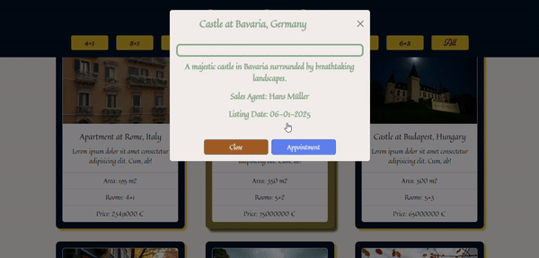

# Luxury Real Estate

- This project is a luxurious real estate website that allows users to explore and filter premium properties. It includes an intuitive design, with a modern UI and interactive features like modals and dynamic property listings.

## Demo

### 1. General Layout

- This demo showcases the general layout of the website, including the structure of the main sections and how content is displayed on different devices. The layout adjusts responsively based on the screen size.


### 2. Buttons

- This demo highlights the functionality of the buttons used throughout the website. It demonstrates their styling, hover effects, and how they trigger actions like opening modals or navigating to different sections.


### 3. Modal and Appointment Button

- In this demo, you can see how the modal works. It is triggered by the Appointment button, which opens a modal window for the user to interact with. This feature is used to book appointments or interact with other related content.



### 4. Responsive Design

- This demo shows how the website's design adapts to different screen sizes. The layout adjusts seamlessly from desktop to mobile views, ensuring a smooth and user-friendly experience on all devices.


## Features & Functionality

- **Property Listings:** A list of high-end properties displayed dynamically based on the user's filter selection (e.g., the number of rooms). Each property includes detailed information such as price, location, sales agent, description, and images.

- **Filter Functionality:** Users can filter the properties displayed by selecting a specific number of rooms.

- **Modal Window:** When users click on a property, a modal window opens to display additional details such as a larger image, description, and specific details of the property.

- **Appointment Button:** Each property has an "Appointment" button which triggers a modal window, allowing users to schedule a meeting with the sales agent for further inquiries or viewings.

- **Image Carousel:** A carousel component to showcase the images of each property, providing users with a more interactive way of viewing property details.

- **Dynamic Data Fetching:** The property data, including images and descriptions, are dynamically fetched and displayed in the application. The luxuryHomes data is managed and rendered dynamically based on user inputs.

## Technologies Used

- **React:** For building the user interface and managing state across components.

- **React Bootstrap:** For responsive grid and layout components like Container, Row, etc.

- **SCSS:** For advanced styling, leveraging mixins and variables to streamline design and maintainability.

- **JavaScript:** For dynamic functionality like filtering properties, handling modal states, and managing user interactions.

### Features in Detail

- **Modal Component:** Each property card is interactive, and upon clicking a property, a modal window opens that provides more detailed information about the property. The modal includes:

  1. A larger image of the property.
  2. Detailed description and property specifications.
  3. Buttons for scheduling an appointment with the sales agent.

- **Appointment Button:** In the modal, there is an Appointment button that allows users to schedule a meeting with the sales agent. This button is styled with a transition effect to make it interactive.

- **Dynamic Data:** Data for the properties (like images, price, description, etc.) are stored in a JSON-like format and rendered dynamically in the app. The properties can be filtered based on the rooms field using React state management (useState).

- **Filter Function:** The app allows users to filter properties by the number of rooms. The selectedRoom state determines which properties to show based on user selection. This filter works seamlessly with the dynamic data display.

- **Image Hover Effects:** The property images come with hover effects that zoom in for a better view, giving a more engaging user experience.

### Installation

1. **Clone the repository:**

```
git clone https://github.com/your-username/luxury-real-estate-website.git
```

2. **Navigate to the project directory:**

```
cd luxury-real-estate-website
```

3. **Install dependencies:**

```
npm/pnpm/etc.. install
```

4. **Run the application:**

```
npm/pnpm/etc. start
```

### Folder Structure

```
/luxury-real-estate-website
|-- /public
|-- /src
    |-- /components
        |-- Header
        |-- Carousel
        |-- Properties
        |-- Footer
    |-- /scss
    |-- App.js
    |-- App.scss
    |-- index.js
```

#### Contributing

- Feel free to fork this repository, create branches, and submit pull requests to improve the project. Any suggestions or improvements are welcome.

#### License

- This project is licensed under the MIT License.
